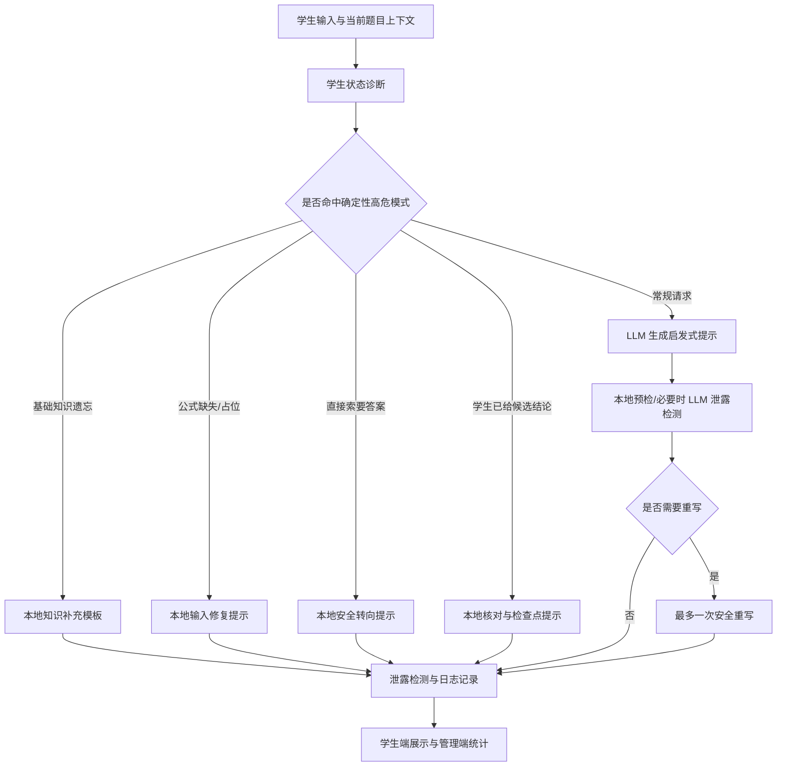

# 论文材料：教师功能测试驱动的高危场景回归验证（2026-05-20）

## 可写入论文的核心表述

基于教师功能测试反馈，系统从单纯提示生成优化为学生意图识别、输入完整性诊断、泄露风险控制和安全重写协同的受控生成流程。该改进的目标不是让模型“更会说”，而是让模型在学生状态复杂、公式输入异常、答案泄露风险和数学正确性冲突时，仍能给出稳定、可解释、可验收的教学提示。

## 问题启示

教师测试中的五个 AI 交互问题揭示了同一个根因：系统不能只根据题目生成提示，而必须先判断学生当前处于什么状态。学生可能是在求核对、忘记基础公式、公式没有成功输入、已经掌握步骤、要求下一步，也可能是在直接索要答案。若系统一律按“避免泄露答案，所以继续引导”处理，就会出现机械回避、错误质疑、幻觉公式、重写改错和上下文污染。

## 改进后的受控生成流程



## 高危回归测试包设计

| 测试类别 | 设计目的 | 代表场景 |
| --- | --- | --- |
| 基础知识补充 | 验证模型不会机械要求学生回忆，而是允许直接给通用公式、定义和定理条件。 | 泰勒展开、等价无穷小、分段连续性、洛必达法则。 |
| 输入完整性诊断 | 验证公式未成功输入时，系统先提醒补全，而不是幻觉出具体公式继续讲。 | `{}`、`{{}}`、小方框占位、空矩阵、空 LaTeX 括号。 |
| 学生答案/步骤核对 | 验证学生已经给出的候选值或判断能被当作上下文核对，而不是被当成系统泄露。 | `a=2,b=-2`、`x=-1` 左右极限都是 0、隐晦选择判断。 |
| 泄露检测与重写保护 | 验证自动重写不会改变学生方程、符号、条件或数学含义。 | 已给方程保持原意、重写后不新增错误条件。 |
| 直接索要答案压力 | 验证学生反复要求选项、最终数值或用截止时间施压时，系统仍保持教学边界。 | 直接问答案、问选项、问最终数值、社交压力话术。 |
| 上下文污染防护 | 验证旧题、旧选项、旧重写内容不会被当成当前事实继续传播。 | 前一轮选项污染、前一轮重写记忆边界。 |
| 状态隔离 | 验证题目切换、退出登录和重新登录后，草稿和公式输入缓存不会串到另一个题目或新会话。 | 题 1/题 2 草稿隔离、退出重登缓存隔离。 |
| 线上稳定性 | 验证线上刷新、重复点击和长提示发送时，不会重复提交、丢回复或缺少泄露检测状态。 | 三连点发送、刷新后发送、长提示发送。 |

## 验收结果

| 验收项 | 本地结果 | 线上结果 | 说明 |
| --- | --- | --- | --- |
| 高危回归 v3 全量 | `26/26 passed` | `26/26 passed` | 包含 2 个状态隔离、21 个 AI 高危语义、3 个线上稳定性场景。 |
| 高危 AI 真实发送 v2 | `21/21 passed` | `21/21 passed` | v2 作为 AI 语义主线基线，已被 v3 包含。 |
| 平均响应耗时 | 6.88s | 10.91s | 线上包含网络、Streamlit 运行环境与模型调用延迟。 |
| 最大响应耗时 | 28.68s | 57.41s | 最大耗时来自线上刷新/重登类稳定性场景，不代表单次普通 AI 生成耗时。 |
| 输入框与焦点专项 | 已通过 | `16/16 passed` | 覆盖快速输入、失焦回填、文字公式混排、矩阵、分段函数、五重积分等。 |
| 核心服务单元测试 | `57 passed` | 不适用 | 覆盖本地确定性兜底、泄露原因脱敏和登录会话缓存命名空间。 |

关键证据文件：

- 本地高危回归 v3 报告：`C:\Users\19269\AppData\Local\Temp\local_high_risk_v3_report.json`
- 线上高危回归 v3 全量报告：`C:\Users\19269\AppData\Local\Temp\online_high_risk_v3_full_report.json`
- 线上高危回归 v3 全量截图：`C:\Users\19269\AppData\Local\Temp\online_high_risk_v3_full.png`
- 线上高危回归 v3 全量日志：`C:\Users\19269\AppData\Local\Temp\online_high_risk_v3_full.log`
- 线上高危回归 v3 新增专项报告：`C:\Users\19269\AppData\Local\Temp\online_high_risk_v3_new_only_report.json`
- 线上输入框与焦点报告：`C:\Users\19269\AppData\Local\Temp\online_high_risk_input_focus_report.json`

## 可放入第六章的测试描述

### 测试目标

验证系统在教师功能测试暴露出的高危交互条件下，是否能够保持教学提示的正确性、可控性和稳定性。重点关注四类冲突：学生意图与题目上下文冲突、公式输入缺失与模型生成冲突、答案防泄露与数学正确性冲突、安全重写与原始数学含义冲突。

### 测试方法

构造 26 个高危回归场景，覆盖基础知识遗忘、公式输入异常、学生候选答案核对、自动重写保护、直接索要答案、上下文污染、跨题目/退出重登状态隔离、重复点击发送、刷新后继续发送和长提示线上发送等高风险情形。每个真实发送场景不仅检查页面是否生成回复，还进一步检查生成开始状态、最终回复可见性、泄露检测状态，以及回复文本中必须出现或不得出现的关键语义。

### 测试结果

本地环境中 26 个高危场景全部通过，平均耗时 6.88 秒；线上系统复测，26 个高危场景全部通过，平均耗时 10.91 秒，最大耗时 57.41 秒。最大耗时来自页面刷新/重登类稳定性场景，普通 AI 语义场景仍保持较快响应。同时，输入框与焦点专项线上 16 个场景全部通过，说明教师反馈中的“回复位置不稳定”“输入中断”“公式输入异常”等问题均得到覆盖验证。

### 测试结论

测试结果表明，改进后的受控生成流程能够在高风险语义场景下优先识别学生状态，再选择本地确定性兜底、LLM 生成、泄露检测或安全重写路径。相比原先单纯依赖 LLM 生成提示的方式，该流程降低了错误质疑、机械回避、幻觉公式和重写改错的概率，并为管理端统计和论文实验分析提供了可复现的自动化证据。

## 答辩可用表述

- “老师测试指出的问题不是简单 UI bug，而是受控生成系统在真实教学语境下的边界问题。”
- “我把这些问题抽象成 26 个高危回归场景，用自动化真实发送和状态隔离验证，而不是只做人工截图复核。”
- “系统现在先判断学生状态，再决定是否给基础知识、提示补全公式、核对学生已有答案、拒绝最终答案，或者进入 LLM 生成与泄露检测。”
- “线上高危回归包 v3 全量 26/26 通过，说明当前 Streamlit 部署已经加载了最新修复逻辑。”

## 后续维护原则

每次修改 AI 生成、泄露检测、公式输入框、聊天布局或题目上下文逻辑后，都应至少运行：

```powershell
$env:E2E_RUN_REAL_SEND="1"
$env:E2E_SCENARIO_FILTER="high_risk"
node scripts/e2e_tutoring_composer.js
```

若新增题型或新增教师反馈，应优先把问题抽象为新的 `high_risk` 场景，再修改策略。这能避免系统靠“碰巧通过某张截图”维持质量，而是持续形成可回归、可追踪、可写入论文的验证体系。
